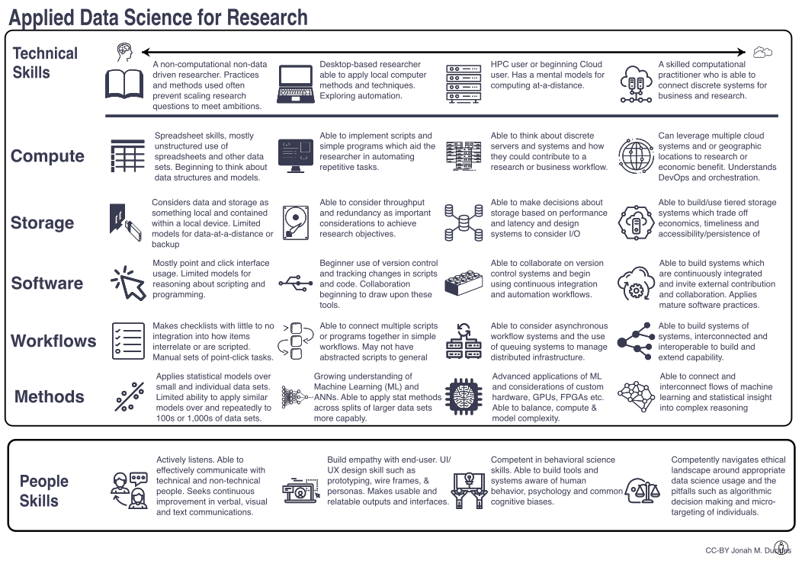

Copyright Jonah Duckles - 2019 
Licensed as [CC-BY](https://creativecommons.org/licenses/by/4.0/)

Please suggest improvements by filing a [GitHub Issue](https://github.com/jduckles/dsskills/issues) 

# Makefile dependencies 

You shouldn't need these as all the conversions are present in the repo, but if you're trying to adapt to run elsewhere this makefile can be used to convert all the `.svg` files in a particular directory to `.png` 300dpi `.png` and `.pdf`. It will also minify the SVGs if you have svgo installed (`npm install -g svgo`). 

* Imagemagick (convert SVG-PNG)
* svgo - svg minifier
* inkscape (convert SVG-PDF)
